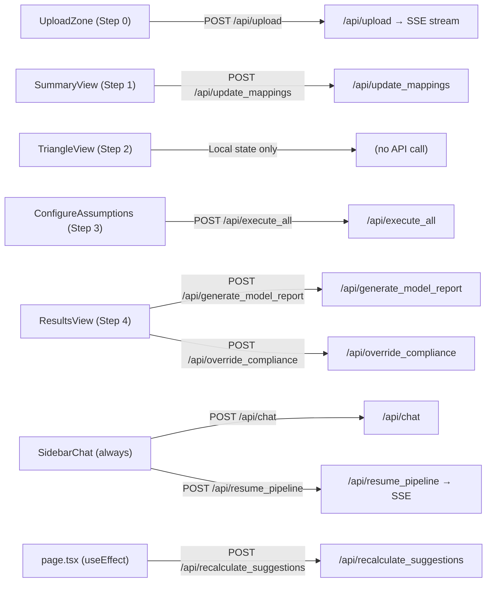
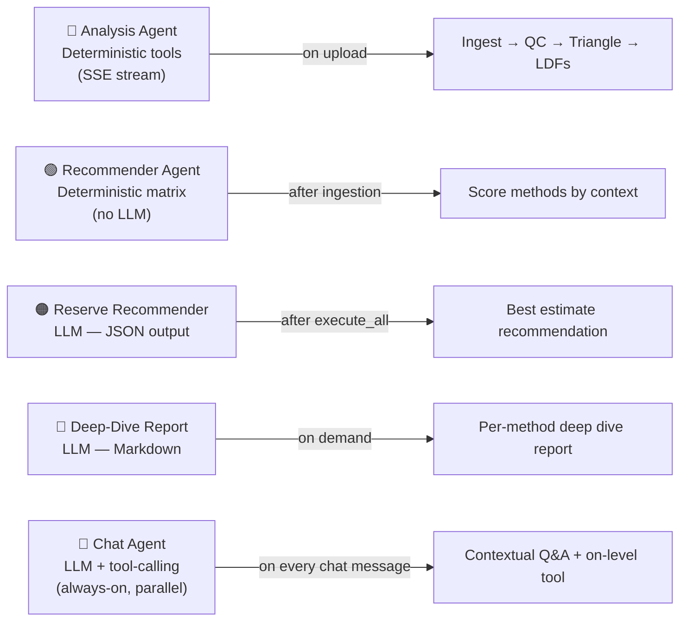

# Actuarial Reserving Platform — Repository Architecture Review

> **Living Document** — Last updated: 2026-06-27 (rev 9)
> Auto-maintained by Antigravity. Updated whenever source files change.

---

## Tech Stack

| Layer | Technology |
|---|---|
| Frontend | Next.js 14 (App Router), TypeScript, Vanilla CSS |
| Backend | Python FastAPI (uvicorn), Server-Sent Events (SSE) |
| AI Layer | Universal OpenAI-compatible client (Ollama / OpenRouter / GPT / Gemini) |
| Export Libraries | `xlsx` (SheetJS) for Excel, `jspdf` + `jspdf-autotable` for PDF |
| Deployment | Vercel (frontend) + Render (backend) |

---

## Frontend Components

All live in `frontend/src/app/components/`.

| Component | File | Step | Purpose |
|---|---|---|---|
| **StepProgress** | `StepProgress.tsx` | Always | Top header step-indicator (5-step workflow). Handles clickable navigation. |
| **SidebarChat** | `SidebarChat.tsx` | Always | Left panel — streams agent logs, chat messages, action events. Hosts user chat input and ConditionsPanel. |
| **SettingsModal** | `SettingsModal.tsx` | Always | Floating modal for LLM connection config (API key, Base URL, Model). Saved to `localStorage`. |
| **UploadZone** | `UploadZone.tsx` | 0 | Drag-and-drop CSV upload + rate change inputs + business context form. Fires `POST /api/upload`. |
| **SummaryView** | `SummaryView.tsx` | 1 | Parsed data summary (AYs, dev periods, total paid, completeness, entities). Column role remapping + entity filtering. Fires `POST /api/update_mappings`. |
| **TriangleView** | `TriangleView.tsx` | 2 | Paid + incurred loss development triangles. Interactive LDF selection (VW, straight avg, 3yr, 5yr), custom overrides, tail factor. |
| **ConfigureAssumptions** | `ConfigureAssumptions.tsx` | 3 | Per-method config panel — enable/disable, paid vs incurred source, A Priori ELR, decay, mature years, iterations, curve type, CDF threshold. Fires `POST /api/execute_all`. |
| **ParamsView** | `ParamsView.tsx` | 3 | Sub-component: renders individual parameter input fields per method. |
| **ResultsView** | `ResultsView.tsx` | 4 | Comparative dashboard — IBNR, Ultimate, Loss Ratio, CV, Maturity Score, Reserve-to-Case, diff-from-median. AI recommendation card, compliance audit, per-method deep-dive reports. |
| **ModelSelector** | `ModelSelector.tsx` | 3 | Renders ranked model cards from the recommender matrix. |
| **ExportMenu** | `ExportMenu.tsx` | 2, 4 | Reusable dropdown export button — triggers CSV, Excel (.xlsx), or PDF download. Used in `TriangleView` and `ResultsView`. |

### Shared Utilities (`frontend/src/app/`)

| File | Purpose |
|---|---|
| `types.ts` | All TypeScript interfaces: `SummaryData`, `TriangleData`, `LDFItem`, `RankedModel`, `ExecuteResult`, `MethodResultItem`, `AIRecommendation`, `ExecutionConfig` |
| `utils.ts` | Currency formatting (`fmt`, `fmtShort`) + `CURRENCIES` lookup |
| `exportUtils.ts` | Shared export utilities: `downloadCSV`, `downloadExcel` (xlsx), `downloadPDF` (jsPDF). All use dynamic imports for SSR safety. |
| `page.tsx` | Root orchestrator — all state, step routing, API calls, SSE stream processing |

---

## Backend API Routes (`backend/main.py`)

All prefixed `/api/`:

| Endpoint | Method | Triggered By | Purpose |
|---|---|---|---|
| `/api/upload` | POST | `UploadZone` | Receive CSV + context, create session, start SSE pipeline stream |
| `/api/resume_pipeline` | POST | `SidebarChat` (ConditionsPanel) | Resume pipeline after user conditions input |
| `/api/update_mappings` | POST | `SummaryView` | Rebuild triangle with new column role mappings / entity scope |
| `/api/execute` | POST | (Legacy) | Run single named model + deterministic flowchart report |
| `/api/execute_all` | POST | `ConfigureAssumptions` | Run all 8 models concurrently (ThreadPoolExecutor), then call Reserve Recommender |
| `/api/chat` | POST | `SidebarChat` | Route user message to Chat Agent |
| `/api/generate_model_report` | POST | `ResultsView` | AI deep-dive Markdown report for one method |
| `/api/override_compliance` | POST | `ResultsView` | Actuary documents override rationale for a compliance flag |
| `/api/recalculate_suggestions` | POST | `page.tsx` (useEffect) | Recalculate suggested ELR + mature years on CDF threshold change |
| `/api/export/{session_id}` | GET | (Direct link) | Export full session JSON (triangles, LDFs, results, diagnostics) |

---

## AI Agents (`backend/agent_workflow.py`)

| Agent | Type | Trigger | Role |
|---|---|---|---|
| **Analysis Agent** | Deterministic (tools) | `POST /api/upload` | Sequential pipeline: ingest → quality check → rate levelling → triangle build → LDF calc. Streams via SSE. |
| **Recommender Agent** | Deterministic (scoring matrix) | After pipeline Part 1 | Scores methods from business context (tail + volatility + env + distortions + n_years + hasPremium). No LLM tokens. |
| **Reserve Recommender Agent** | LLM (JSON output) | After `execute_all` | Reads all method results (IBNR/Ultimate/maturity/CV) and recommends the single best estimate method with confidence + reasoning. |
| **Deep-Dive Report Agent** | LLM (Markdown output) | `POST /api/generate_model_report` | Professional actuarial Markdown analysis of a specific model (methodology, patterns, strengths, limitations). |
| **Chat Agent** | LLM + tool-calling | `POST /api/chat` | Always-on parallel agent. Full session context (triangle, LDFs, diagnostics, results). Tool: `calculate_on_level_premiums`. **Scope-restricted** — declines non-actuarial / non-session questions and redirects user. |

> **Critical Design Principle**: The LLM is never trusted with math. All IBNR, Ultimate, LDF, and CDF values are pure deterministic Python. LLMs only write narratives and recommendations.

---

## Actuarial Methods (`backend/models/methods/`)

| Code | Class | File | Requires Premium | Description |
|---|---|---|---|---|
| `CL` | `ChainLadder` | `chain_ladder.py` | No | Basic chain ladder — CDFs × latest diagonal |
| `MCL` | `MackChainladder` | `mack_chain_ladder.py` | No | CL + variance/standard errors/confidence intervals |
| `BF` | `BornhuetterFerguson` | `bornhuetter_ferguson.py` | Yes | A Priori ELR × expected unreported + actual paid |
| `BK` | `Benktander` | `benktander.py` | Yes | Iterative BF→CL blend (credibility-weighted) |
| `CC` | `CapeCod` | `cape_cod.py` | Yes | Stanard-Buhlmann — derives ELR from actual data |
| `ELR` | `ExpectedLossRatio` | `expected_loss_ratio.py` | Yes | Projects mature historical LRs onto immature years |
| `CLK` | `Clark` | `clark.py` | No | Stochastic curve fitting (Weibull / Log-Logistic) |
| `CO` | `CaseOutstanding` | `case_outstanding.py` | No | IBNR = case reserves currently held |

---

## Supporting Models (`backend/models/`)

| File | Class | Purpose |
|---|---|---|
| `triangle.py` | `Triangle` | Parses wide/long CSV → accident-year × dev-age matrix. Computes LDFs, CDFs, latest diagonal. |
| `classifier.py` | `DataClassifier` | Detects data type (paid/incurred), format (wide/long), CAS format, confidence score. |
| `inspector.py` | `DataInspector` | Detects multi-entity data, maps column roles (paid, incurred, premium, exposure, counts), accumulation states. |
| `compliance.py` | `ComplianceEngine` | ASOP-style compliance audit log. Runs at ingestion, summary, estimation, selection, results stages. |
| `diagnostics.py` | — | `compute_diagnostics()` — paid-to-incurred ratio triangles, settlement rate triangles (for Chat Agent context). |
| `on_level.py` | `OnLevelPremiumCalculator` | Adjusts earned premium to current rate level using historical rate changes (OLF). |
| `tools.py` | — | `compute_suggested_elr()`, `compute_mature_accident_years()`, `compute_method_availability()`, `compute_ibnr_table()`, `compute_loss_ratios()`, `compute_ldf_stability()`, `compute_tail_factor()`, `get_environment_sensitivity()` |

---

## Session Store (In-Memory, `SESSION_STORE` dict)

Key fields stored per session:

```
session_id → {
  csv_text, n_years, valuation_year, api_key, base_url, model_name, business_context,
  df (DataFrame),
  classification (DataClassifier result),
  inspection (DataInspector result),
  triangle (Triangle object),
  ldfs, incurred_ldfs,
  summary (dict for frontend),
  results (all method outputs + ai_recommendation),
  compliance_engine (ComplianceEngine instance),
  report (flowchart JSON string),
  selected_entities
}
```

> ⚠️ No database — all state is in-memory for the duration of the server process.

---

## Mermaid Diagrams

### Full System Architecture

```mermaid
graph TB
    subgraph FRONTEND["Frontend — Next.js"]
        UI["page.tsx (State Orchestrator)"]
        SP["StepProgress"]
        SB["SidebarChat"]
        UZ["UploadZone"]
        SV["SummaryView"]
        TV["TriangleView"]
        CA["ConfigureAssumptions"]
        RV["ResultsView"]
        SM["SettingsModal"]
    end

    subgraph BACKEND["Backend — FastAPI"]
        UPLOAD["/api/upload"]
        RESUME["/api/resume_pipeline"]
        UPDATE["/api/update_mappings"]
        EXEC_ALL["/api/execute_all"]
        EXEC["/api/execute"]
        CHAT["/api/chat"]
        REPORT["/api/generate_model_report"]
        COMPLIANCE["/api/override_compliance"]
        SUGGEST["/api/recalculate_suggestions"]
        EXPORT["/api/export/{session_id}"]
    end

    subgraph AGENTS["agent_workflow.py — Agent Layer"]
        AA["Analysis Agent (sequential pipeline)"]
        RA["Recommender Agent (deterministic matrix)"]
        RRA["Reserve Recommender Agent (LLM)"]
        DRA["Deep-Dive Report Agent (LLM)"]
        CHA["Chat Agent (LLM + tool calls)"]
    end

    subgraph MODELS["models/ — Math Engine"]
        TRI["Triangle"]
        CLS["DataClassifier"]
        INS["DataInspector"]
        CE["ComplianceEngine"]
        DIAG["Diagnostics"]
        OLF["OnLevelPremiumCalculator"]
        TOOLS["tools.py"]
        METHODS["8 Actuarial Methods"]
    end

    LLM["LLM Provider (OpenAI / Ollama / Gemini / OpenRouter)"]

    UZ -->|"POST multipart/form-data"| UPLOAD
    SV -->|"POST JSON"| UPDATE
    CA -->|"POST JSON"| EXEC_ALL
    RV -->|"POST JSON"| REPORT
    RV -->|"POST JSON"| COMPLIANCE
    SB -->|"POST JSON"| CHAT
    SB -->|"POST JSON"| RESUME
    UI -->|"POST JSON"| SUGGEST

    UPLOAD --> AA
    RESUME --> RA
    UPDATE --> AA
    EXEC_ALL --> RRA
    CHAT --> CHA
    REPORT --> DRA

    AA --> CLS
    AA --> INS
    AA --> TRI
    AA --> OLF
    AA --> TOOLS
    AA --> CE

    RRA --> LLM
    DRA --> LLM
    CHA --> LLM
    CHA --> OLF

    EXEC_ALL -->|"ThreadPoolExecutor\n(max 8 workers)"| METHODS
    METHODS --> TRI
    METHODS --> TOOLS
```



### Frontend → API Mapping



### Agent Roles



---

## Changelog

| Date | Change |
|---|---|
| 2026-06-27 | Initial document created from full repository analysis |
| 2026-06-27 | Chat Agent (`run_parallel_chat`) — added Rule 7 scope restriction to `sys_inst`; agent now declines off-topic questions |
| 2026-06-27 | Export feature — added `ExportMenu.tsx` component, `exportUtils.ts` (CSV/Excel/PDF), wired into `TriangleView` (triangle + LDF export) and `ResultsView` (method comparison + AY detail + AI rec export). New deps: `xlsx`, `jspdf`, `jspdf-autotable` |
| 2026-06-27 | Added 'Reserve' column (Reserves = Ultimate - Paid) in the Results dashboard after 'Projected Ultimate' column and updated exports. |
| 2026-06-27 | Separated Paid and Incurred LDF table exports in the Triangle View so both are exported completely for all formats. |
| 2026-06-27 | Added Paid and Incurred Age-to-Age link ratio factors to the Triangle View exports across CSV, Excel, and PDF formats. |
| 2026-06-27 | Added comparison chart metric toggle in the Results view to switch between Projected Ultimate, Reserve, and Projected IBNR bars. |
| 2026-06-27 | Fixed ChatRequest Pydantic schema in main.py to resolve chatbot failure (swapped user_text for message and added history field). |
| 2026-06-27 | Added custom lightweight Markdown parser to `SidebarChat.tsx` to render markdown formatting (tables, lists, bold) inside chatbot replies. |
